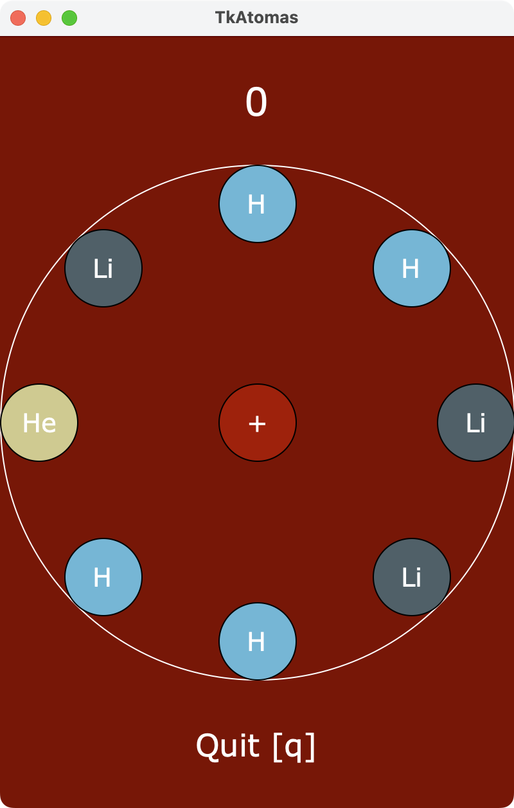

# TkAtomas

## Project Description
TkAtomas is a chemistry-inspired puzzle game where the player uses protons to fuse atoms of the same element together to create atoms with a higher atomic number. The game continues until the board is overfilled, or, in Time Attack mode, until time runs out.

## Competitive Analysis
TkAtomas is based on the iOS and Android game, Atomas, by developer Sirnic Games. Like the mobile version, this implementation will consist of four modes: Classic (play until the board is filed), Time Attack, Geneva (uses luxons, which behave differently from protons), and Zen (provides for easier gameplay). However, scoring is calculated in a much simpler manner.

## Structural Plan
The project is divided into several files focusing on core gameplay graphics, event-handling for each gameplay mode, gamescreen graphics, and displaying the graphical user interface. The core graphics file consists of classes defining gameplay elements like atoms, protons, neutrons, neutrinos, and the gameboard itself, as well as universal event handling methods for the fusion of atoms, animation, and drawing on the canvas. In the gameplay modes file, each mode is defined as a class with its own event-handling and gameboard drawing methods that implement the core graphics classes. Likewise, the gamescreen graphics file implements classes for the the main gamescreen, selecting a mode, and displaying scores. Finally, the GUI file (atomas.py) implements the gamescreen and gameplay classes using a Tkinter animation framework.